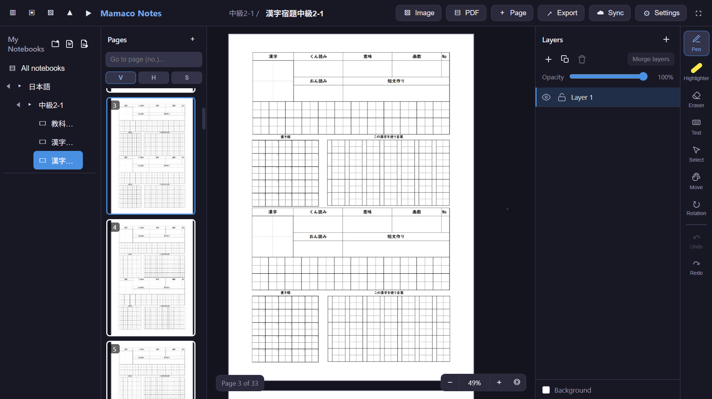

# Mamaco Notes

**English** | [Português](README.pt-BR.md)

  

**Mamaco Notes** is a digital note-taking application designed for hand-writing and drawing, serving as a cross-platform alternative to Samsung Notes. It is built to work seamlessly across **Windows**, **Linux**, **Android**, and the **Web**.

This project was developed almost 100% using **MonkeyCodeAI**, leveraging AI-assisted development to create a robust and feature-rich application.

## 📸 Screenshots

  

Beyond the technology, **Mamaco Notes** represents a personal learning journey. As a developer exploring the world of multi-platform development (Windows, Linux, and Android) for the first time, I am using this project as a hands-on way to master new tools, architectures, and the challenges of creating a seamless experience across different devices.

## 🚀 Key Features

-   **Multi-Platform Support**: Available as a Desktop app (Electron for Windows/Linux), a Mobile app (Capacitor for Android), and a PWA (Progressive Web App).
-   **Advanced Drawing Engine**: A custom-built Canvas 2D engine supporting:
    -   Pressure-sensitive Pen and Marker tools.
    -   Efficient Eraser (strokes and image erasing).
    -   Selection tool with free-form, rectangle, and circle regions.
    -   Delimited selection (split strokes and crop images dynamically).
-   **Layer Management**: Professional-grade layer system allowing you to:
    -   Add, rename, duplicate, and merge layers.
    -   Adjust opacity and toggle visibility/locking.
    -   Organize content (images, text, strokes) hierarchically.
-   **Cloud Synchronization**: Bidirectional sync via **WebDAV**. Currently validated primarily with **Koofr**; while it supports the standard WebDAV protocol (Nextcloud, ownCloud, etc.), full compatibility with other providers is still being verified. **Network resilience**: connection failures are retried automatically (3 attempts with backoff) with a friendly message when the server is unreachable — never retries HTTP/auth errors.
-   **Local Trash**: Deleted folders and notebooks go to a local (non-synced) trash where each item can be restored individually. Items deleted "local + cloud" are restored from the local copy; items deleted "local only" with a cloud configured can be brought back with **"Restore from cloud"**. Retention is 30 days.
-   **PDF & Image Integration**:
    -   Import PDFs as new notebooks or as page backgrounds.
    -   Insert and transform images (move, resize, rotate).
    -   Export your notes as high-quality PNG or PDF files.
-   **Organization**:
    -   Nested folders and notebooks for easy categorization.
    -   Drag-and-drop reordering for folders, notebooks, and pages.
    -   Multi-selection support for bulk actions (copy, move, delete).
-   **Intelligent UI & UX**:
    -   Multi-touch support for tablets and phones (pinch zoom, pan).
    -   Custom gestures: two-finger double-tap for **Undo**, three-finger double-tap for **Redo**, two fingers to move/zoom, and three-finger twist for **Page rotation**.
    -   Software Update system: automatic check on startup for all platforms with release notes preview. Desktop updates install silently and restart the app automatically, without blocking dialogs.
    -   Full localization in **English** and **Portuguese (pt-BR)**.
    -   Dark/Light mode support and customizable toolbar/sidebar visibility (with floating buttons for quick restoration).
    -   Option to hide the tool cursor for a cleaner drawing experience.
-   **Security & Persistence**:
    -   Data stored locally using **IndexedDB** (saved automatically).
    -   Session restoration to automatically reopen the last notebook and page, and each notebook remembers its last viewed page (returning to it when you switch notebooks or reopen the app).
    -   Manual full backup (JSON) import/export (**passwords excluded for security**).
    -   **OOM-safe on Android**: large notebook sync happens in chunks (HTTP Range downloads and streamed PUT uploads), so big payloads never cross the Capacitor bridge in one call.
    -   **Sync bug fixes**: deleted items never come back (tombstones are respected when pulling) and a folder delete propagates to its subfolders/notebooks; restoring an item from the trash re-uploads it to the cloud instead of deleting it again.

## 🛠️ Tech Stack

-   **Frontend**: [React 18](https://reactjs.org/) + [TypeScript](https://www.typescriptlang.org/)
-   **Build Tool**: [Vite 6](https://vitejs.dev/)
-   **State Management**: [Zustand](https://github.com/pmndrs/zustand)
-   **Persistence**: IndexedDB (local) & WebDAV (cloud)
-   **Desktop**: [Electron](https://www.electronjs.org/)
-   **Mobile**: [Capacitor](https://capacitorjs.com/)
-   **Drawing Engine**: Custom HTML5 Canvas 2D implementation
-   **PDF Processing**: `pdfjs-dist`

## 📁 Project Structure

For a detailed map of the project files, architecture, and information lookup, please refer to the [Project Structure Documentation](docs/PROJECT_STRUCTURE.md).

## 📜 Open Source & Future

This project is **open-source** and free to use at your convenience. Although it started as a personal tool, I am committed to continuous improvement, fixing bugs, and enhancing the overall experience.

## 💡 Suggestions & Support

I am always open to suggestions and feedback! Since this is a learning project, there are many features that have not been extensively tested yet, and some may not work 100% as expected. Your feedback after testing the app is extremely important to help me identify and fix issues.

If you have ideas for improvements or want to report a bug, please let me know.

If you find this project useful and would like to support its development financially, you can donate through:
- ☕ **Ko-fi**: [ko-fi.com/yabaihonyaku](https://ko-fi.com/yabaihonyaku)
- 💸 **Pix (Brazil)**: `mamaconotes@gmail.com`

  

## 🤖 Developed with AI

Mamaco Notes is a testament to the power of AI in modern software engineering. The entire architecture, drawing logic, synchronization algorithms, and UI components were developed through a collaborative process using **MonkeyCodeAI** and **Google Gemini**.

---

*Made with 🍌 by the Mamaco Team.*  
*P.S.: If you also came to see the monkey, you're in the right place!*
