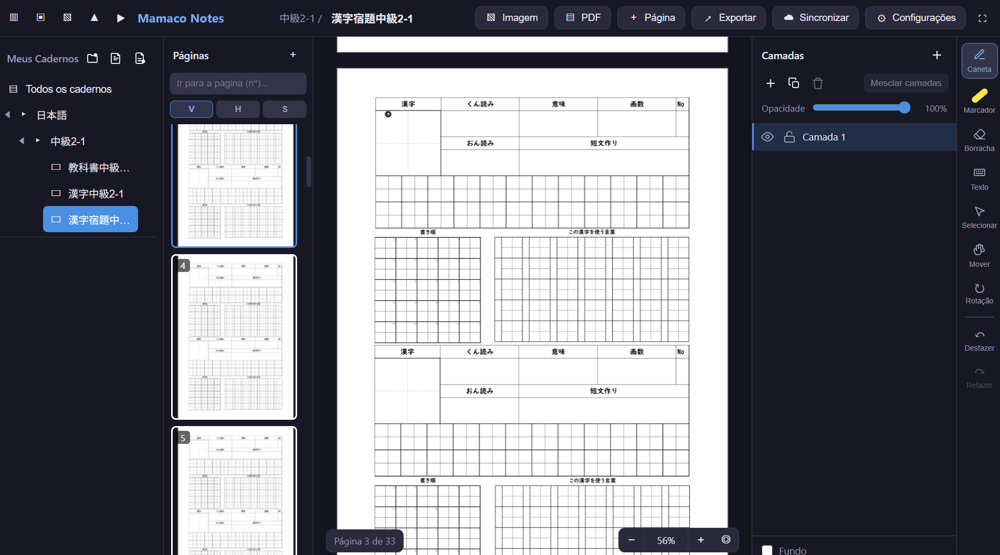

# Mamaco Notes

[English](README.md) | **Português**

  

O **Mamaco Notes** é um aplicativo de anotações digitais projetado para escrita à mão e desenho, servindo como uma alternativa multiplataforma ao Samsung Notes. Ele foi construído para funcionar perfeitamente no **Windows**, **Linux**, **Android** e na **Web**.

Este projeto foi desenvolvido quase 100% usando o **MonkeyCodeAI**, aproveitando o desenvolvimento assistido por IA para criar uma aplicação robusta e rica em recursos.

## 📸 Capturas de Tela

  

Além da tecnologia, o **Mamaco Notes** representa uma jornada pessoal de aprendizado. Como um desenvolvedor explorando o mundo do desenvolvimento multiplataforma (Windows, Linux e Android) pela primeira vez, estou usando este projeto como uma forma prática de dominar novas ferramentas, arquiteturas e os desafios de criar uma experiência fluida em diferentes dispositivos.

## 🚀 Principais Funcionalidades

-   **Suporte Multiplataforma**: Disponível como app Desktop (Electron para Windows/Linux), app Mobile (Capacitor para Android) e PWA (Progressive Web App).
-   **Motor de Desenho Avançado**: Um motor customizado em Canvas 2D que suporta:
    -   Ferramentas de Caneta e Marcador sensíveis à pressão.
    -   Borracha eficiente (apaga traços e partes de imagens).
    -   Ferramenta de seleção com regiões de forma livre, retângulo e círculo.
    -   Seleção delimitada (divide traços e recorta imagens dinamicamente).
-   **Gerenciamento de Camadas**: Sistema de camadas de nível profissional que permite:
    -   Adicionar, renomear, duplicar e mesclar camadas.
    -   Ajustar opacidade e alternar visibilidade ou bloqueio.
    -   Organizar conteúdo (imagens, texto, traços) hierarquicamente com pastas e um **painel de camadas redimensionável**.
-   **Sincronização em Nuvem**: Sincronização bidirecional via **WebDAV**. Atualmente validado principalmente com o **Koofr**; embora suporte o protocolo WebDAV padrão (Nextcloud, ownCloud, etc.), a compatibilidade total com outros provedores ainda está sendo verificada. **Resiliência de rede**: falhas de conexão são repetidas automaticamente (3 tentativas com backoff) com mensagem amigável quando o servidor está inacessível — nunca repete erros HTTP/auth.
  -   **Atualizações**: as atualizações do desktop forçam o fechamento do app em execução automaticamente, e o instalador continua cancelável durante a cópia dos arquivos.
-   **Lixeira Local**: Pastas e cadernos excluídos vão para uma lixeira local (não sincronizada) onde cada item pode ser restaurado individualmente. Itens excluídos "local + nuvem" são restaurados da cópia local; itens excluídos "só local" com nuvem configurada podem voltar com **"Restaurar da nuvem"**. A retenção é de 30 dias.
-   **Integração com PDF e Imagens**:
    -   Importe PDFs como novos cadernos ou como fundo de páginas.
    -   Insira e transforme imagens (mover, redimensionar, rotacionar).
    -   Exporte suas notas como arquivos PNG ou PDF de alta qualidade.
-   **Organização**:
    -   Pastas e cadernos aninhados para fácil categorização.
    -   **Barra de busca** para encontrar rapidamente pastas e cadernos pelo nome.
    -   **Renomear** pastas, cadernos (barra lateral/superior) e camadas (painel de camadas) pelo menu de contexto, duplo clique ou pelo atalho **F2** no último item clicado (fallback para o item selecionado/ativo).
    -   Reordenação por arrastar e soltar de pastas, cadernos e páginas.
    -   Suporte a seleção múltipla para ações em lote (copiar, mover, excluir).
-   **UI & UX Inteligente**:
    -   Suporte a multi-toque para tablets e celulares (zoom de pinça, pan).
    -   Gestos customizados: toque duplo com 2 dedos para **Desfazer**, toque duplo com 3 dedos para **Refazer**, 2 dedos para mover/zoom e giro com 3 dedos para **Girar a página**.
    -   Sistema de Atualização: verificação automática ao iniciar em todas as plataformas, com prévia das notas da versão. Atualizações no desktop instalam silenciosamente e reabrem o aplicativo automaticamente, sem diálogos que travem a instalação; o instalador do Windows também migra instalações cujo desinstalador legado retorna o erro 2.
    -   Localização completa em **Português (pt-BR)** e **Inglês**.
    -   Suporte a modo Escuro/Claro e visibilidade customizável de barras (com botões flutuantes para restauração rápida).
    -   Opção para ocultar o cursor da ferramenta para uma experiência de desenho mais limpa.
-   **Segurança e Persistência**:
    -   Dados armazenados localmente usando **IndexedDB** (salvamento automático).
    -   Restauração de sessão para reabrir automaticamente o último caderno e página, e cada caderno lembra a última página aberta (voltando a ela ao alternar de caderno ou reabrir o app).
    -   Importação/exportação de backup manual completo (JSON) (**senhas excluídas por segurança**). No mobile, a exportação abre o **seletor "Salvar como" do sistema** para que você escolha exatamente onde salvar seu arquivo de backup.
    -   **À prova de OOM no Android**: a sincronização de cadernos ocorre em chunks (downloads HTTP por Range e uploads PUT em um único stream nativo), para que payloads grandes nunca atravessem a ponte do Capacitor em uma única chamada; os chunks PUT preservam o tamanho em bytes UTF-8 de notas com acentos ou texto não latino.
    -   **Correções de sync**: a sincronização manual e o auto-sync usam o mesmo algoritmo — um caderno editado localmente é **enviado**, nunca baixado por cima da edição (o conteúdo puxado é aplicado antes de o baseline avançar, então uma falha na aplicação é tentada de novo no próximo sync em vez de ser pulada silenciosamente); timers de persistência locais pendentes são descartados após uma substituição pela nuvem; itens excluídos nunca mais voltam (tombstones são respeitados no pull), baselines locais antigos recuperam o caderno remoto mais novo, e excluir uma pasta se propaga para suas subpastas/cadernos; restaurar um item da lixeira o reenvia para a nuvem em vez de excluí-lo de novo.

## 🛠️ Stack Tecnológica

-   **Frontend**: [React 18](https://reactjs.org/) + [TypeScript](https://www.typescriptlang.org/)
-   **Ferramenta de Build**: [Vite 6](https://vitejs.dev/)
-   **Gerenciamento de Estado**: [Zustand](https://github.com/pmndrs/zustand)
-   **Persistência**: IndexedDB (local) & WebDAV (nuvem)
-   **Desktop**: [Electron](https://www.electronjs.org/)
-   **Mobile**: [Capacitor](https://capacitorjs.com/)
-   **Motor de Desenho**: Implementação customizada em HTML5 Canvas 2D
-   **Processamento de PDF**: `pdfjs-dist`

## 📁 Estrutura do Projeto

Para um mapa detalhado dos arquivos, arquitetura e busca de informações, consulte a [Documentação da Estrutura do Projeto](docs/PROJECT_STRUCTURE.md).

## 📜 Código Aberto e Futuro

Este projeto é **código aberto** e livre para usar à vontade. Embora tenha começado como uma ferramenta pessoal, estou comprometido com a melhoria contínua, correção de bugs e aprimoramento da experiência geral.

## 💡 Sugestões e Suporte

Estou sempre aberto a sugestões e feedback! Por ser um projeto de aprendizado, existem muitas funcionalidades que ainda não foram testadas extensivamente e podem não funcionar 100% como esperado. O seu feedback ao testar o app é extremamente importante para me ajudar a identificar e corrigir problemas.

Se você tiver ideias de melhorias ou quiser reportar um erro, por favor, me avise.

Se você achar este projeto útil e quiser apoiar financeiramente o seu desenvolvimento, você pode doar através de:
- ☕ **Ko-fi**: [ko-fi.com/yabaihonyaku](https://ko-fi.com/yabaihonyaku)
- 💸 **Pix (Brasil)**: `mamaconotes@gmail.com`

  

## 🤖 Desenvolvido com IA

O Mamaco Notes é um testemunho do poder da IA na engenharia de software moderna. Toda a arquitetura, lógica de desenho, algoritmos de sincronização e componentes de UI foram desenvolvidos através de um processo colaborativo com o **MonkeyCodeAI** e o **Google Gemini**.

---

*Feito com 🍌 pela Equipe Mamaco.*  
*P.S.: Se você também "veio ver o macaco", sinta-se em casa!*
